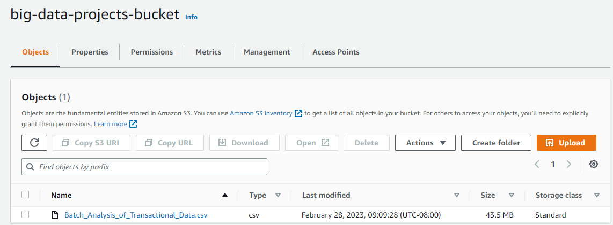
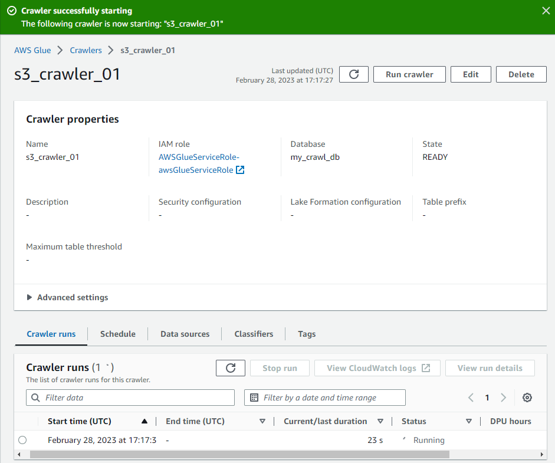
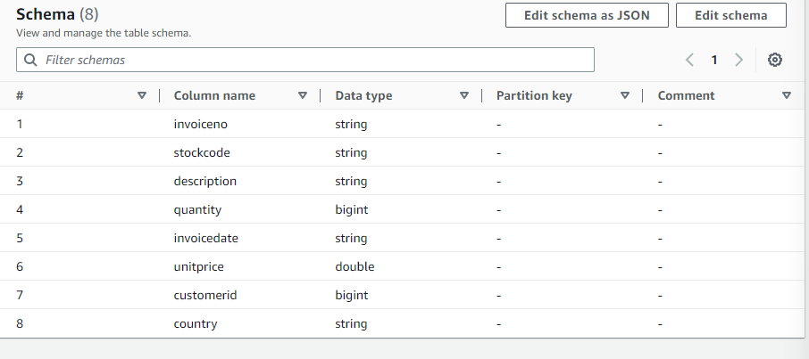
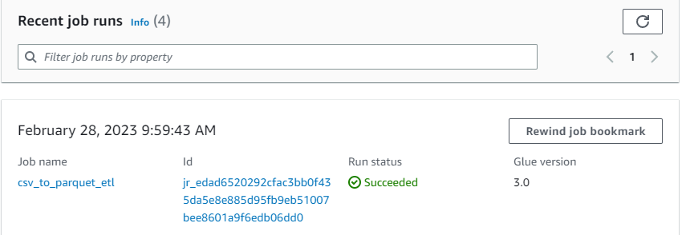
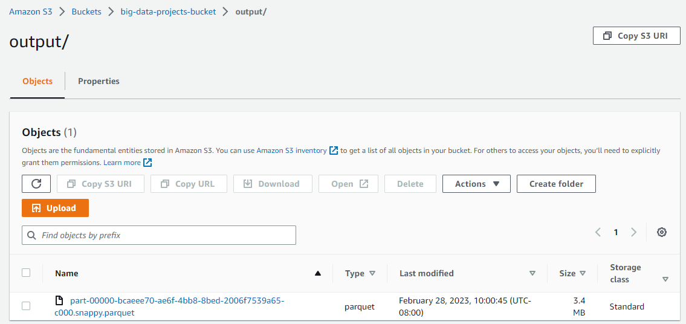
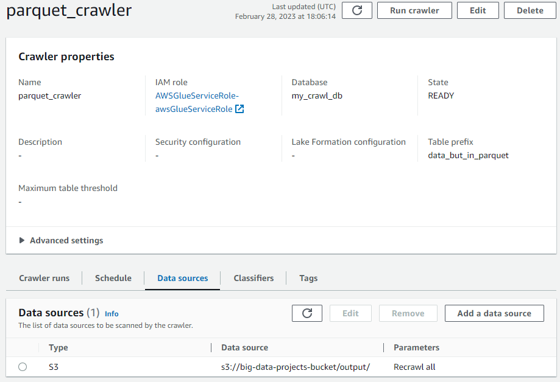
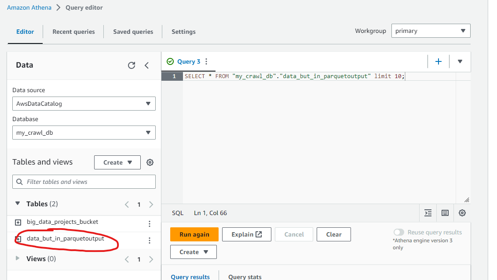
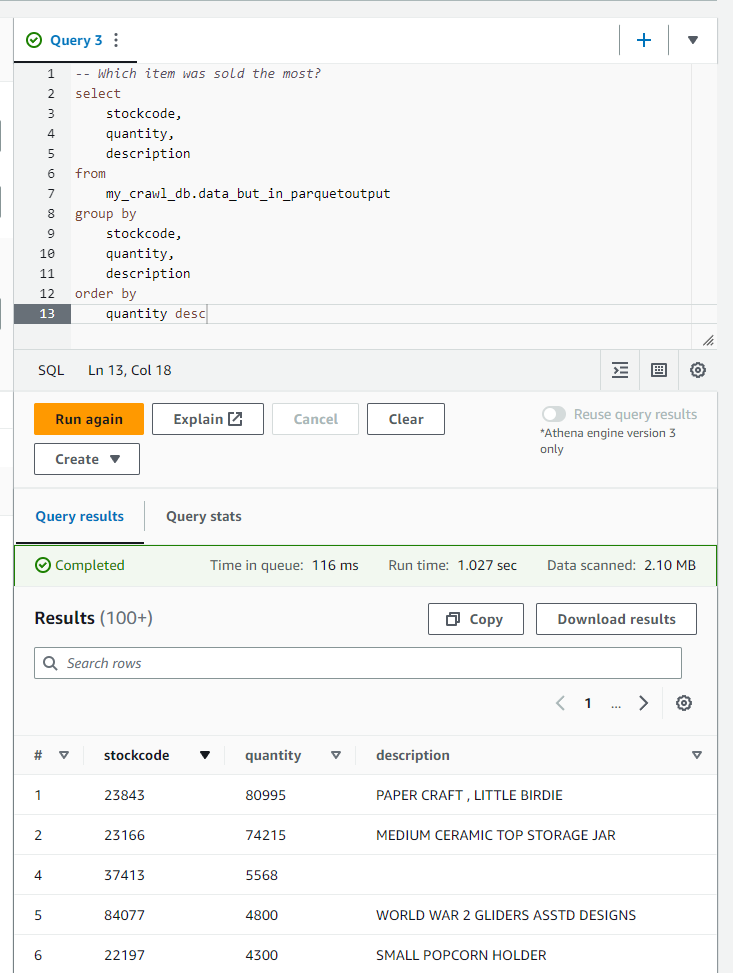
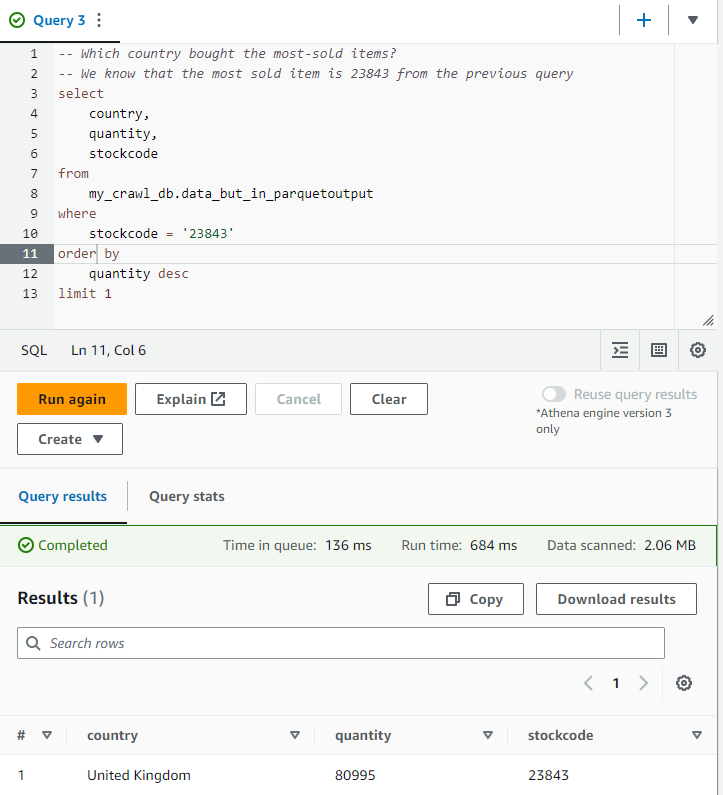

# Batch Analysis of Transactional Data
#### Simplilearn course-end project 1
### Module: Big Data on AWS

## Description:
As a data analytics consultant, you are asked to provide insights and statistics across products, brands, categories, and segments to the marketing, product, sales, and procurement teams and inform them about which product has the highest amount of sales and which product and its marketing needs the most improvements. These statistics will help to run effective digital marketing campaigns. The scope of this project is limited to data engineering and analysis

## Objective: 
To use AWS Big Data stack to analyze transactions, uncover patterns, and share actionable insights

## AWS Services Used:
<svg class="w-6 h-6" height="40" width="40" xmlns="http://www.w3.org/2000/svg"><defs><linearGradient x1="0%" y1="100%" x2="100%" y2="0%" id="Arch_Amazon-S3-Standard_32_svg__a"><stop stop-color="#1B660F" offset="0%"></stop><stop stop-color="#6CAE3E" offset="100%"></stop></linearGradient></defs><g fill="none" fill-rule="evenodd"><path d="M0 0h40v40H0z" fill="url(#Arch_Amazon-S3-Standard_32_svg__a)"></path><path d="M30.074 22.671l.2-1.301c1.703 1.016 1.735 1.444 1.732 1.46-.004.003-.308.24-1.932-.159zm-10.185-3.733a.995.995 0 01-.992.994.994.994 0 010-1.99c.547 0 .992.448.992.996zm7.869 12.33c0 .123-.495.31-.93.478l-.445.17c-.475.189-1.037.359-1.669.504-1.576.366-3.75.585-5.817.585-5.503 0-8.435-1.009-8.439-1.798L8.256 13.57c1.899 1.452 5.8 2.382 10.641 2.382 4.63 0 9.364-.897 11.584-2.472l-1.366 8.92c-2.871-.874-6.392-2.56-8.132-3.398l-.105-.05.002-.015c0-1.098-.89-1.99-1.983-1.99a1.988 1.988 0 00-1.983 1.99c0 1.097.89 1.99 1.983 1.99.733 0 1.367-.407 1.71-1.002 1.806.868 5.41 2.591 8.356 3.468l-1.205 7.874zm-8.86-23.273c6.676 0 11.857 1.86 11.894 3.465l-.024.148c-.27 1.579-5.352 3.35-11.87 3.35-6.388 0-10.71-1.725-10.89-3.375l-.015-.12c.023-1.678 4.397-3.468 10.904-3.468zm11.538 12.318l1.344-8.76c.001-.026.006-.05.006-.076C31.786 8.674 25.233 7 18.897 7 12.003 7 7 8.883 7 11.477l.003.061 2.468 19.73c0 2.6 7.852 2.732 9.426 2.732 2.137 0 4.394-.228 6.04-.61a12.74 12.74 0 001.81-.548l.432-.167c.844-.321 1.57-.598 1.564-1.331l1.18-7.684c.655.158 1.197.24 1.63.24.58-.001.973-.143 1.21-.428a.982.982 0 00.219-.832c-.127-.681-.923-1.405-2.546-2.327z" fill="#FFF"></path></g></svg>
<svg class="w-6 h-6" height="40" width="40" xmlns="http://www.w3.org/2000/svg"><defs><linearGradient x1="0%" y1="100%" x2="100%" y2="0%" id="Arch_AWS-Glue_32_svg__a"><stop stop-color="#4D27A8" offset="0%"></stop><stop stop-color="#A166FF" offset="100%"></stop></linearGradient></defs><g fill="none" fill-rule="evenodd"><path d="M0 0h40v40H0z" fill="url(#Arch_AWS-Glue_32_svg__a)"></path><path d="M27.163 15.543c-1.839.412-4.673.495-6.663.495-1.977 0-4.785-.082-6.625-.486l5.539 8.197a.504.504 0 01.086.281v1.068c.701.202 1.349.205 2 .007V24.03c0-.1.03-.2.087-.282l5.576-8.205zm1.69-.771l.03.02-6.383 9.392v1.276a.5.5 0 01-.314.464 4.382 4.382 0 01-1.653.329 4.909 4.909 0 01-1.706-.324.501.501 0 01-.327-.47v-1.275l-6.395-9.465A.572.572 0 0112 14.41c0-1.425 4.692-1.689 7.488-1.72l.012 1.002c-3.343.036-5.421.41-6.212.7.943.309 3.533.644 7.212.644 3.45 0 5.943-.295 7.017-.587-.5-.133-1.416-.315-3.078-.519l.121-.994c4.122.503 4.44.928 4.44 1.474 0 .131-.06.25-.147.362zM16.5 11.008h1v-1.001h-1v1.001zm-1 .501V9.506a.5.5 0 01.5-.501h2a.5.5 0 01.5.5v2.004a.5.5 0 01-.5.501h-2a.5.5 0 01-.5-.5zm5-3.506h1V7.002h-1v1.001zm-1 .501V6.501A.5.5 0 0120 6h2a.5.5 0 01.5.5v2.004a.5.5 0 01-.5.501h-2a.5.5 0 01-.5-.5zm2 4.508h1V12.01h-1v1.002zm-.5-2.004h2a.5.5 0 01.5.501v2.004a.5.5 0 01-.5.5h-2a.5.5 0 01-.5-.5v-2.004a.5.5 0 01.5-.5zm3.424 18.325a.5.5 0 01-.079.536l-3.469 3.96a.5.5 0 01-.752 0l-3.469-3.96a.5.5 0 01.376-.83h1.453v-1.002h1v1.503a.5.5 0 01-.5.5h-.849L20.5 32.74l2.365-2.699H22a.5.5 0 01-.5-.5v-1.503h1v1.002h1.469c.196 0 .374.114.455.294z" fill="#FFF"></path></g></svg>
<svg class="w-6 h-6" height="40" width="40" xmlns="http://www.w3.org/2000/svg"><defs><linearGradient x1="0%" y1="100%" x2="100%" y2="0%" id="Arch_Amazon-Athena_32_svg__a"><stop stop-color="#4D27A8" offset="0%"></stop><stop stop-color="#A166FF" offset="100%"></stop></linearGradient></defs><g fill="none" fill-rule="evenodd"><path d="M0 0h40v40H0z" fill="url(#Arch_Amazon-Athena_32_svg__a)"></path><path d="M18.726 14.285c1.8 0 2.982.285 3.42.5-.438.214-1.62.498-3.42.498-1.8 0-2.982-.284-3.42-.499.438-.214 1.62-.499 3.42-.499zm.014 3.198c-.088-.027-.164-.079-.164-.181 0-.14.114-.253.256-.253.042 0 .072.026.107.043l-.199.391zm2.939 4.156a1.203 1.203 0 01-.303.156 4.024 4.024 0 01-.566.166 9.261 9.261 0 01-1.978.202c-1.542 0-2.616-.322-2.846-.522l-.688-5.794c1.187.401 2.937.433 3.428.433.496 0 2.275-.033 3.464-.445l-.202 2.298a34.447 34.447 0 01-2.44-1.048.754.754 0 00-1.475.216.753.753 0 001.041.69c1.178.56 2.09.944 2.781 1.186l-.216 2.462zm-7.525-6.797l.822 6.891c0 1.411 3.698 1.427 3.856 1.427.78 0 1.564-.08 2.206-.226.269-.061.507-.133.71-.212.624-.241.94-.574.938-.946l.204-2.305c.299.068.534.098.715.098.478 0 .604-.189.69-.319l.077-.476c-.122-.492-1-1.187-1.297-1.404l.224-2.543-.005-.001c.001-.014.007-.027.007-.042 0-1.424-3.811-1.496-4.575-1.496-.764 0-4.575.072-4.575 1.496 0 .02.008.037.01.057h-.007zm4.591-5.448c4.765 0 8.643 3.803 8.643 8.478s-3.878 8.478-8.643 8.478c-4.765 0-8.642-3.803-8.642-8.478s3.877-8.478 8.642-8.478zM6.017 21.267v.998h4.177a9.69 9.69 0 008.551 5.082c5.326 0 9.66-4.25 9.66-9.475 0-5.224-4.334-9.475-9.66-9.475-4.41 0-8.132 2.917-9.283 6.886H6.017v.997h3.217a9.236 9.236 0 00-.148 1.592c0 .136.015.268.02.403H5v.997h4.203c.105.693.285 1.36.535 1.995H6.017zm27.486 11.265c-.614.603-1.68.608-2.295.005l-5.253-5.152a12.068 12.068 0 002.34-2.246l5.214 5.142a1.566 1.566 0 01-.006 2.25zm.726-2.955l-5.334-5.26a11.64 11.64 0 001.953-6.445C30.848 11.326 25.418 6 18.745 6 13.95 6 9.6 8.782 7.665 13.087l.93.402c1.773-3.943 5.757-6.492 10.15-6.492 6.112 0 11.086 4.879 11.086 10.875s-4.974 10.876-11.086 10.876c-3.732 0-7.192-1.827-9.254-4.885l-.848.551c2.251 3.338 6.027 5.331 10.102 5.331 2.333 0 4.506-.662 6.356-1.788l5.388 5.286c.498.488 1.159.757 1.86.757a2.66 2.66 0 001.872-.761 2.55 2.55 0 00.008-3.662z" fill="#FFF"></path></g></svg>

S3, Glue, Athena

## Steps:

1. Upload data to S3 bucket (UTF-8 format)
2. Create a crawler to crawl the CSV data and generate a metadata catalog
3. Create a Glue job to transform the data to Parquet format
4. Add another crawler to crawl the new Parquet files to generate metadata for Anthena queries
5. Query data to identify the best-selling item and countries where customers have bought the most-sold item using Athena

## Process write-up:

## 1. Upload data to S3 bucket (UTF-8 format)

## 2. Create a crawler to crawl the CSV data and generate a metadata catalog

Crawlers are used to populate AWS data catalog with tables. In this case, the crawler is used to create a table from our csv file

## 3. Create a Glue job to transform the data and output to Parquet format (Code written in Glue-Spark, stored in glue_job.py)

        Make sure to add S3 access role onto the job

## 4. Add another crawler to crawl the new Parquet files to generate metadata for Anthena queries

## 5. Query data to identify the best-selling item and countries where customers have bought the most-sold item using Athena

